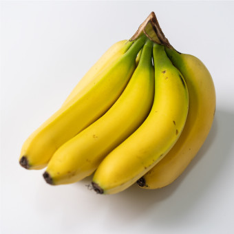

# 송길주 마크다운과제
---
> 2024.07.29

## 문제 1

```javascript
const name = req.body.name;
if (name === undefined) {
console.log('이름이 없습니다.');
}
```


---

## 문제 2

```javascript
const name = req.body.name;
if (name === undefined) {
console.log('이름이 없습니다.');
}
```



